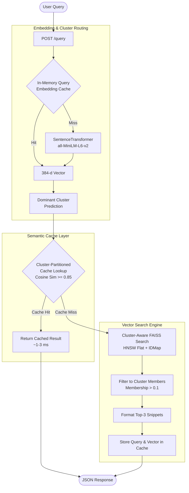

# ⚡ Cluster-Aware Semantic Search & Semantic Caching System

An ultra-low latency semantic search engine powered by **FAISS HNSW**, **Sentence-Transformers**, **Gaussian Mixture Model (GMM) Fuzzy Clustering**, and an intelligent **Cluster-Routed Semantic Cache**.

Built on the **UCI 20 Newsgroups corpus (~16,590 documents)**, this system avoids redundant vector searches and LLM/embedding workloads by identifying semantically equivalent queries within domain clusters.

---

## 📌 System Architecture



---

## ✨ Key Features

- **🎯 Cluster-Routed Semantic Cache**: Partitioned by GMM topic clusters. Reduces semantic lookup complexity from $O(N)$ across all queries to $O(N_k)$ within the query's topic space, returning near-instant results for semantically equivalent queries (Cosine Similarity $\ge 0.85$).
- **🏎️ Sub-Millisecond Vector Search**: Uses FAISS HNSW (`IndexHNSWFlat` with $M=32, efConstruction=100, efSearch=50$) with $L_2$ normalized embeddings for exact cosine inner-product indexing.
- **🌐 Fuzzy Clustering (GMM)**: Utilizes Gaussian Mixture Models ($K=12$, determined via Bayesian Information Criterion) capturing multi-topic document overlap with soft membership probability distributions.
- **⚡ Cluster-Aware Search Pruning**: Restricts candidate nearest-neighbor pools to documents with $>0.1$ membership probability in the target cluster, pruning search candidates from ~16.6k to ~1–2k items.
- **📊 Real-Time Metrics & Telemetry**: Built-in HTTP middleware tracking live P50/P95 latencies, cache hit rates, queries per minute (QPM), and cluster traffic distributions.

---

## 📁 Repository Structure

```
semantic-cache-system/
├── app/
│   ├── api_service/
│   │   ├── __init__.py
│   │   └── main.py                # FastAPI endpoints, metrics middleware, startup hooks
│   ├── clustering_layer/
│   │   ├── __init__.py
│   │   └── fuzzy_cluster.py       # GMM training, BIC analysis, soft memberships
│   ├── config/
│   │   └── __init__.py
│   ├── data_layer/
│   │   ├── __init__.py
│   │   ├── data_loader.py         # 20 Newsgroups parser, header/quote cleaner
│   │   └── rebuild_all.py         # End-to-end data & indexing pipeline builder
│   ├── embedding_layer/
│   │   ├── __init__.py
│   │   └── embedding_model.py     # SentenceTransformer MiniLM vectorizer (384-d)
│   ├── query_engine/
│   │   └── __init__.py
│   ├── semantic_cache/
│   │   ├── __init__.py
│   │   └── cache_manager.py       # In-memory cluster-routed cache with LRU eviction
│   └── vector_store/
│       ├── __init__.py
│       ├── cluster_search.py      # Cluster-filtered FAISS vector retrieval
│       └── faiss_index.py         # HNSW index builder and search operations
├── data/
│   ├── cluster_meta.json          # GMM cluster metadata
│   ├── cluster_probs.npy          # [16590, 12] soft membership matrix
│   ├── corpus.json                # Cleaned document corpus (JSONL)
│   ├── embeddings.npy             # [16590, 384] float32 document embeddings
│   ├── index_meta.json            # FAISS index metadata
│   └── news_index.faiss           # Persisted HNSW binary index
├── requirements.txt               # Dependencies
└── README.md
```

---

## 🚀 Quickstart Guide

### 1. Prerequisites & Environment Setup

Ensure you have **Python 3.10+** installed.

```bash
# Clone the repository
git clone <repo-url>
cd semantic-cache-system

# Create and activate a virtual environment
python -m venv venv
# On Windows:
.\venv\Scripts\activate
# On Linux/macOS:
source venv/bin/activate

# Install dependencies
pip install -r requirements.txt
```

### 2. (Optional) Rebuild the Pipeline from Scratch

The repository already includes pre-built indexes and embeddings under `data/`. If you want to download raw data and regenerate all embeddings, clusters, and FAISS indices:

```bash
python -m app.data_layer.rebuild_all
```

### 3. Launch the API Service

Start the FastAPI application with Uvicorn:

```bash
uvicorn app.api_service.main:app --host 0.0.0.0 --port 8000 --reload
```

The interactive Swagger API documentation will be available at `http://localhost:8000/docs`.

---

## 🔌 API Reference

### 1. `POST /query`
Performs semantic search with cluster routing and semantic caching.

**Request Body:**
```json
{
  "query": "space mission failure causes"
}
```

**Response (`cache_hit: false` - First query):**
```json
{
  "query": "space mission failure causes",
  "cache_hit": false,
  "matched_query": null,
  "similarity_score": 0.0,
  "result": "- The satellite malfunction was traced to a booster failure during stage 2 separation...\n- Historical telemetry logs from early Apollo tests indicate...",
  "dominant_cluster": 3
}
```

**Response (`cache_hit: true` - Semantically similar query):**
```json
{
  "query": "why did the space missions fail?",
  "cache_hit": true,
  "matched_query": "space mission failure causes",
  "similarity_score": 0.912,
  "result": "- The satellite malfunction was traced to a booster failure during stage 2 separation...\n- Historical telemetry logs from early Apollo tests indicate...",
  "dominant_cluster": 3
}
```

---

### 2. `GET /cache/stats`
Returns aggregate statistics of the semantic cache.

**Response:**
```json
{
  "total_entries": 142,
  "hit_count": 58,
  "miss_count": 84,
  "hit_rate": 0.408
}
```

---

### 3. `DELETE /cache`
Purges the cache and resets all hit/miss counters.

**Response:** `204 No Content`

---

### 4. `GET /metrics`
Returns operational performance metrics and latency percentiles.

**Response:**
```json
{
  "p50_latency_ms": 4.12,
  "p95_latency_ms": 18.75,
  "cache_hit_rate": 0.41,
  "embedding_cache_hit_rate": 0.65,
  "queries_per_minute": 32,
  "top_clusters": [3, 8, 1]
}
```

---

## 🔬 Tech Stack & Key Choices

| Component | Technology | Rationale |
| :--- | :--- | :--- |
| **API Framework** | [FastAPI](https://fastapi.tiangolo.com/) | High-performance asynchronous REST API with automatic OpenAPI documentation. |
| **Embedding Model** | `all-MiniLM-L6-v2` | Fast CPU inference, 384-dimensional dense vectors with high semantic accuracy. |
| **Vector Index** | [FAISS](https://github.com/facebookresearch/faiss) (`IndexHNSWFlat`) | Sub-millisecond ANN search with high recall and $L_2$ normalized cosine similarity. |
| **Clustering** | [Scikit-Learn](https://scikit-learn.org/) `GaussianMixture` | Soft/fuzzy topic assignments ($K=12$) representing overlapping real-world news categories. |
| **Caching Engine** | In-Memory LRU + Cosine Sim | Zero external infrastructure overhead; provides sub-5ms semantic cache hits. |

---

## 📈 Performance Characteristics

- **Cache Hit Latency**: `~1 - 3 ms`
- **Cache Miss (FAISS HNSW Search)**: `~10 - 25 ms` (including query embedding generation)
- **Candidate Reduction**: Cluster filtering reduces candidate evaluation space by **~85-90%**.
- **Memory Footprint**: ~300MB RAM for the full corpus vectors, index, and models.
